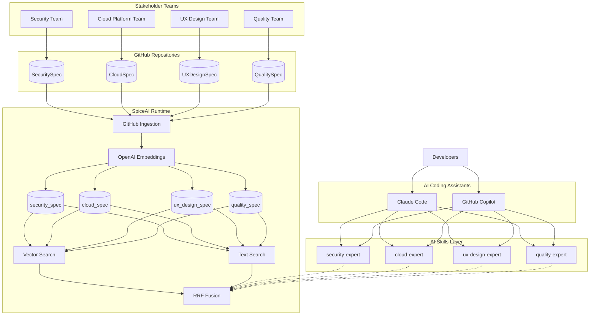
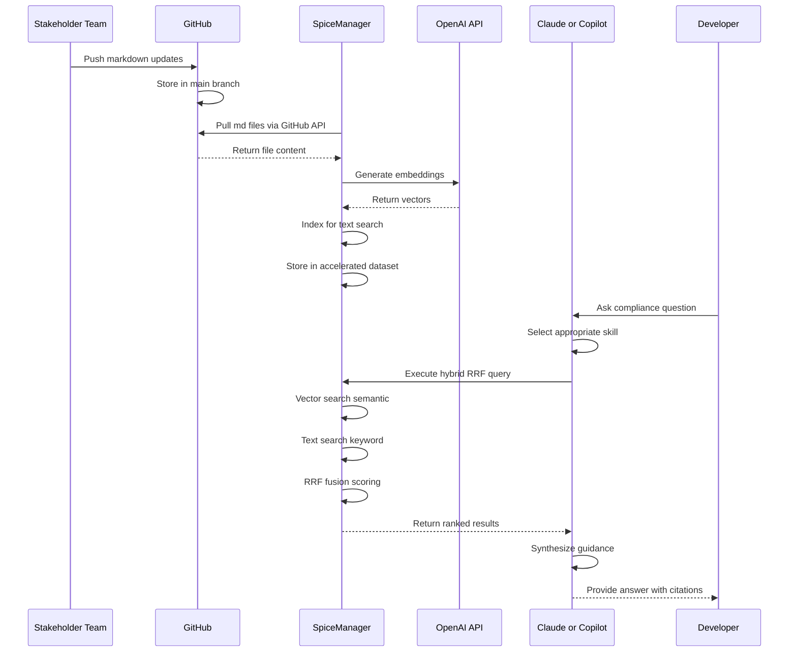
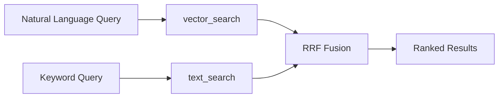
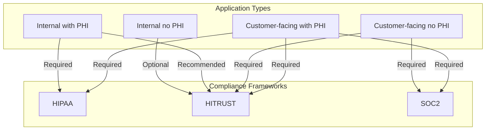

# Expert Organization Architecture

## System Architecture Diagram

## Data Flow Sequence

## Hybrid RRF Query Flow

## Compliance Matrix

## Technology Stack

| Layer | Technology | Purpose |
|-------|-----------|---------|
| **Source Control** | GitHub | Spec repositories, version control |
| **Runtime** | SpiceAI | Data federation, search, acceleration |
| **Embeddings** | OpenAI text-embedding-3-small | Vector generation for semantic search |
| **Search** | Hybrid RRF | Combined vector + keyword search |
| **AI Interface** | Claude Code, GitHub Copilot | Developer interaction layer |
| **Skills** | Markdown files | Skill definitions with query templates |

## How It Works

1. **Stakeholder teams** maintain compliance specs as markdown in GitHub repos
2. **SpiceManager** pulls markdown files and generates OpenAI embeddings
3. **Datasets** store both vector embeddings and text indices
4. **Hybrid RRF search** combines semantic and keyword search for best results
5. **AI Skills** define query templates for each domain expert
6. **Developers** invoke skills via Claude Code or GitHub Copilot
7. **AI assistants** return guidance with citations from the spec documents
